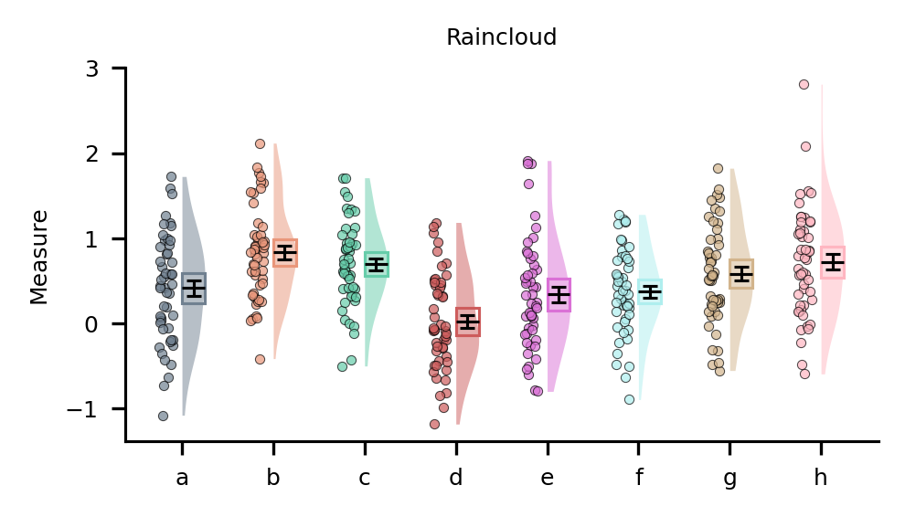
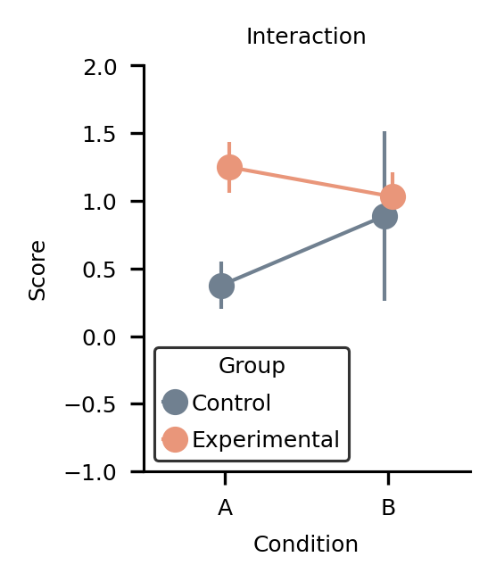

# myplotlib

My custom matplotlib stuff. I got inspired to do this by [this blogpost](https://colcarroll.github.io/yourplotlib/) and this [PyData Talk](https://www.youtube.com/watch?v=NV4Y75ZUDJA).

This is very much a work in progress. See the [gallery notebook](https://github.com/moltaire/myplotlib/blob/master/gallery.ipynb) for function calls, example data, etc.

Currently included:

## Plots

### Histogram

### Raincloud plot

A combination of different plot types. The inset boxplot displays the confidence interval (CI) for the mean, with mean and standard error bars. Means ± SE are shown as a horizontal line with error bars. I stole the idea for this plot from [here](https://doi.org/10.1017/S0033291722001593).

### Violin plot

### Scatter plot

### Linear Model plot

This plot runs a linear regression using `statsmodels` and annotates the plot with intercept $\beta_0$, slope $\beta$, and product-moment correlatio coefficient $r$.

### Interaction plot

A line plot with errorbars, split by two categorical variables.

### Factorial heatmap

I used this in this [paper](https://journals.plos.org/ploscompbiol/article?id=10.1371/journal.pcbi.1010283).

### Model recovery plot

This plot is adapted from

- Findling, C., Chopin, N., & Koechlin, E. (2020). Imprecise neural computations as a source of adaptive behaviour in volatile environments. Nature Human Behaviour. https://doi.org/10.1038/s41562-020-00971-z

I used this in this [paper](https://journals.plos.org/ploscompbiol/article?id=10.1371/journal.pcbi.1010283).

## Utilities

### Subplot labelling

### Annotation

### Axis breaking

**Note that this is purely visual, and does not change the actual plotted data**. I use it to better communicate if I set limits so that 0 is excluded from the range of values, but still want the axis origin to be labelled 0.

## Stats

### BMS

Basic, sampling based python implementation of the model selection procedure described in

- Stephan, K. E., Penny, W. D., Daunizeau, J., Moran, R. J., & Friston, K. J. (2009). Bayesian model selection for group studies. NeuroImage, 46(4), 1004–1017. https://doi.org/10.1016/j.neuroimage.2009.03.025

Currently requires `theano` and `pymc3` to be installed. Usage:

`bmsResult = bms(L=L, cores=1)`

The `bmsResult` is a dictionary that contains a `summary` of the MCMC chain, an array of exceedance probabilities `xp` and an array of model rates `r`.