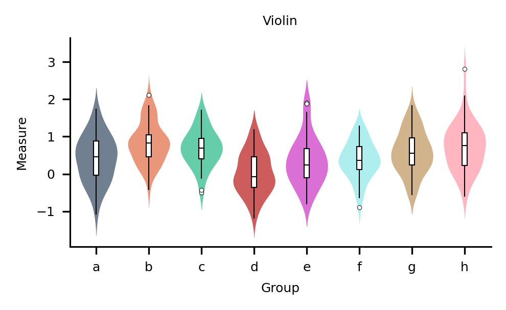
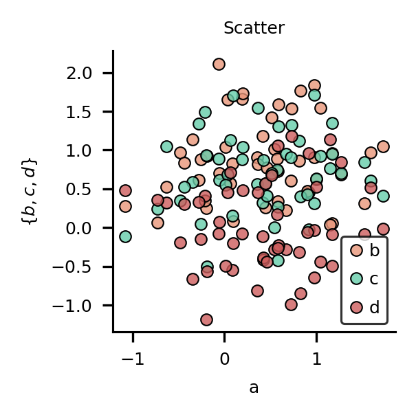

# myplotlib

My custom matplotlib stuff. I got inspired to do this by [this blogpost](https://colcarroll.github.io/yourplotlib/) and this [PyData Talk](https://www.youtube.com/watch?v=NV4Y75ZUDJA).

This is very much a work in progress. See the [gallery notebook](https://github.com/moltaire/myplotlib/blob/master/gallery.ipynb) for function calls.

Currently included:

## Violin plot

## Scatter plot

## Linear Model plot

## Utilities

### Subplot labelling

### Annotation

